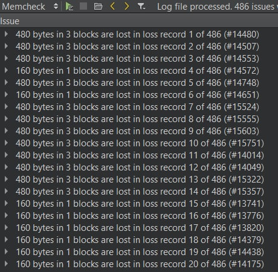
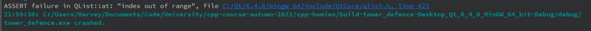

# Testing

Testing was a crucial part of the development. Especially because we had no prior experience of qt. Testing was done manually. When the project advanced and got bigger and more complex, reproducing the found bugs was harder and harder. Thus we started to use screen capture to investigate the steps leading to that bug. Also qt creator’s built in debugger was used extensively. Git, miro board and telegram chat was used to track the issues and the progress to solve them. 
A few problems required cooperation since some parts of the project were more familiar to other team members. For these situations we used Telegram or had extra meetings on our Discord channel.

## Troubleshooting example gallery

An attempt to figure out how to set up memory analysis in QT creator using Heop.
(conclusion: heop is extremely difficult to debug with.)

Learning QT, 2022 colorized.

Bug: Memory leak from when a comment tower is sold, resulting in path tiles being replace with either wrong path tiles or tower squares, or appearing in a random rotation. The images depict both in-game screenshots and theories on what is happening. It took us half a week to figure out it was due to a memory leak.

Bug: Confusion between x and y coordinate system and row-column coordinate system resulting in a flipped double check for tower placement. (All possible tower positions were filled, but notice the line of symmetry across the x-y line)

Tower placement and tower range indicator testing.

Bug: Under heavy lag, the end-of-game signal can be triggered repeatedly. The image depicts the game running at roughly 0.5fps and 122 dialog windows asking for a leaderboard entry. Eventually solved by disconnecting the signal on the first trigger (and reconnecting when a new game is started).

Lag limit testing with a large number of valgrinds. Done in multiple build modes to see performance differences.

Learning of QT memory checking tools. As we were all running QT creator on Windows, valgrind was not an option. After heob, we discovered Deleaker. This is the first time running Deleaker (95% of the issues were solved when we realized our entire game view was not being deleted when the program exited.)

Bug: Due to an index value being off by 1, an issue regarding enemy pathfinding arose, where enemies would move diagonally and then freeze.

Bug. No idea what happened, but it seems to have resolved itself.

Bug: The index out of range bug occurred due to our misunderstanding of the QT memory management system. Occured in two areas, but quickly resolved.

Further stress testing of our game.
